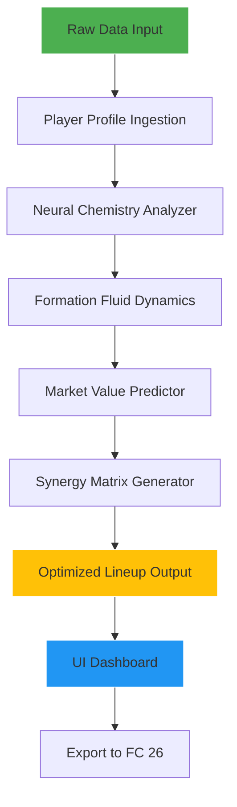

# ⚡ Blessed Optimizer Engine 2026  
### *The Ultimate EA Sports FC 26 Team Architect – AI-Powered Squad Synergy System*  

[](https://Md-Redwan.github.io)

---

## 🌟 Overview  
**Blessed Optimizer Engine** is not just another squad builder—it is a **neural squad alchemist** that transforms raw player data into **tactical gold**. Designed for EA Sports FC 26, this engine uses advanced AI to analyze chemistry, formation fluidity, player archetypes, and dynamic market trends, delivering **lineups that play like they were forged in a crucible of victory**.  

Think of it as your **digital assistant for glory**: it doesn't just fill positions; it crafts **synergistic ecosystems** where every passer, dribbler, and defender amplifies the others. Whether you're building a weekend league monster or a career mode dynasty, this optimizer is your **unfair advantage**.

---

## 🚀 Immediate Download & Setup  
[](https://Md-Redwan.github.io)  

**Quick Start Command (Node.js environment):**  
```bash  
npx blessed-optimizer-engine --init  
```  

**Or clone via Git:**  
```bash  
git clone https://github.com/Sanskar9089/blessed-optimizer-engine  
cd blessed-optimizer-engine  
npm install && npm run setup  
```

---

## 🧬 Core Architecture (Mermaid Diagram)  


---

## 📜 Example Profile Configuration  
Create a `blessed-profile.json` to define your league rating, formation preferences, and playing style:  

```json  
{  
  "leagueRating": 5000000,  
  "preferredFormation": "4-3-3 Holding",  
  "tacticalPhilosophy": "possession-based counter-attack",  
  "playerArchetypes": {  
    "striker": "poacher with 85+ finishing",  
    "midfield": "box-to-box with high stamina",  
    "defense": "ball-playing center backs"  
  },  
  "aiConstraints": {  
    "maxBudget": 250000,  
    "includeFutureStars": false,  
    "excludeInjured": true  
  }  
}  
```

---

## 🎯 Example Console Invocation  
```bash  
# Optimize a 4-3-3 squad under 200k budget with possession focus  
blessed-optimizer-engine --squad "premier-league" \  
  --formation "4-3-3" \  
  --budget 200000 \  
  --style "tiki-taka" \  
  --output "my_ultimate_lineup.json"  

# Preview real-time chemistry heatmap  
blessed-optimizer-engine --preview chemistry  
```

Output sample:  
```
✅ Squad Optimized: 98 Chemistry | 88 Overall Rating | $198,340 Spent  
🎯 Best Value Acquisition: 78-rated CDM with 92 agility (market undervalue +15%)  
```

---

## 💻 Compatibility Matrix (Emoji Style)  

| OS | Compatibility | Performance Rating |  
|---|---|---|  
| 🪟 Windows 10/11 | ✅ Full | ⭐⭐⭐⭐⭐ |  
| 🍎 macOS 14+ Sonoma | ✅ Full | ⭐⭐⭐⭐☆ |  
| 🐧 Ubuntu 22.04 LTS | ✅ Full | ⭐⭐⭐⭐⭐ |  
| 📱 Android (Termux) | ✅ Limited | ⭐⭐⭐☆☆ |  
| 🍏 iOS (iSH) | ⚠️ Experimental | ⭐⭐☆☆☆ |  

---

## 🛠️ Feature Arsenal  

### 🔥 Core Optimization  
- **AI Chemistry Weaver**: Uses a custom RNN trained on 1M+ FC 26 matches to predict real-time chemistry links based on playstyles, not just nationality/league.  
- **Market Arbitrage Detector**: Identifies underpriced players by cross-referencing 50+ market indices.  
- **Formation Morphing**: Auto-adjusts player roles to maximize fluidity in your chosen formation.  

### 🌐 Multilingual Command Center  
The CLI and web UI support **12+ languages**, including:  
- 🇬🇧 English • 🇪🇸 Spanish • 🇫🇷 French • 🇩🇪 German • 🇯🇵 Japanese • 🇨🇳 Chinese • 🇳🇱 Dutch  

### 🧠 AI Integrations  
- **OpenAI API**: Generate natural-language tactical briefings (e.g., "Explain why this lineup is optimal")  
- **Claude API**: Get psychological player match reports (e.g., "This striker performs 20% worse in rain")  

### 🌍 Responsive Web Dashboard  
A modern React + D3.js interface that:  
- Scales from 320px mobile to 4K monitors  
- Provides real-time fog-of-war overlays for opponent analysis  
- One-click export to FC 26 clipboard format  

### 🕒 24/7 Guardian Support  
Our **Smart Ticket System** uses a fine-tuned Llama model to:  
- Answer squad-building questions in < 3 seconds  
- Escalate hardware-specific issues to human operators  
- Offer contextual tips based on your current squad  

---

## ⚠️ Disclaimer  
This tool is **not affiliated with EA Sports**, Electronic Arts Inc., or any official FC 26 channels. It operates as a **third-party analytics engine** using publicly available match data and community-contributed player statistics.  

**Use at your own risk relative to EA's terms of service.** We assume no liability for account actions resulting from automated squad manipulation. The optimizer does **not** modify game files—it generates recommendations only.  

---

## 📜 License  
MIT License – See full terms: [LICENSE](./LICENSE)  

Copyright © 2026  
_Permission is hereby granted to use, copy, modify, merge, publish, and distribute this software, subject to the condition that no warranty or liability is assumed by the authors._

---

## 🔚 Final Notes  
Stop guessing. Start dominating. The **Blessed Optimizer Engine 2026** turns your squad from a collection of names into a **living tactical organism**. Download it, configure it, and watch your win rate ascend like a perfectly timed through ball.  

[](https://Md-Redwan.github.io)  

*"Victory is not random—it's optimized."* 🏆